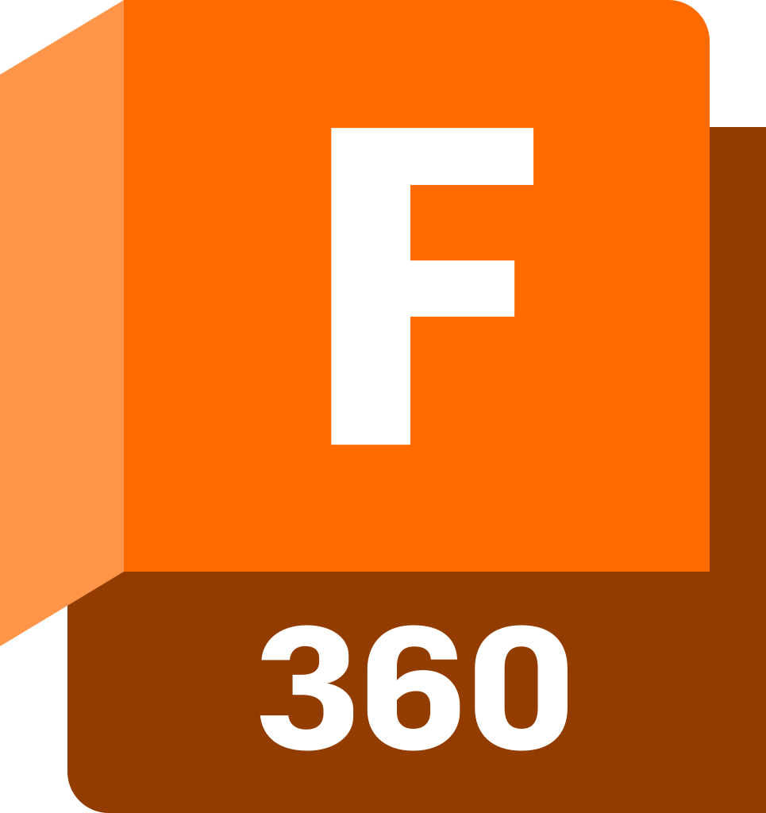

  <h1>
    Hey there!
    
  </h1>

### 🥴 About Me :
I am a student from Germany.
- 👨🏼‍🔧 I’m currently working as a Hardware Engineer.
  
- :seedling: Exploring the world of high frequency signals.

- 📐 Interested in CAD modeling.

- 🎓 Doing my master degree.

---

### :hammer_and_wrench: Programming:

  &nbsp;
  &nbsp;
  &nbsp;

### Platforms

  &nbsp;
  &nbsp;

### Electrical Design

  &nbsp;
  &nbsp;

### 3D Modelling

  &nbsp;

